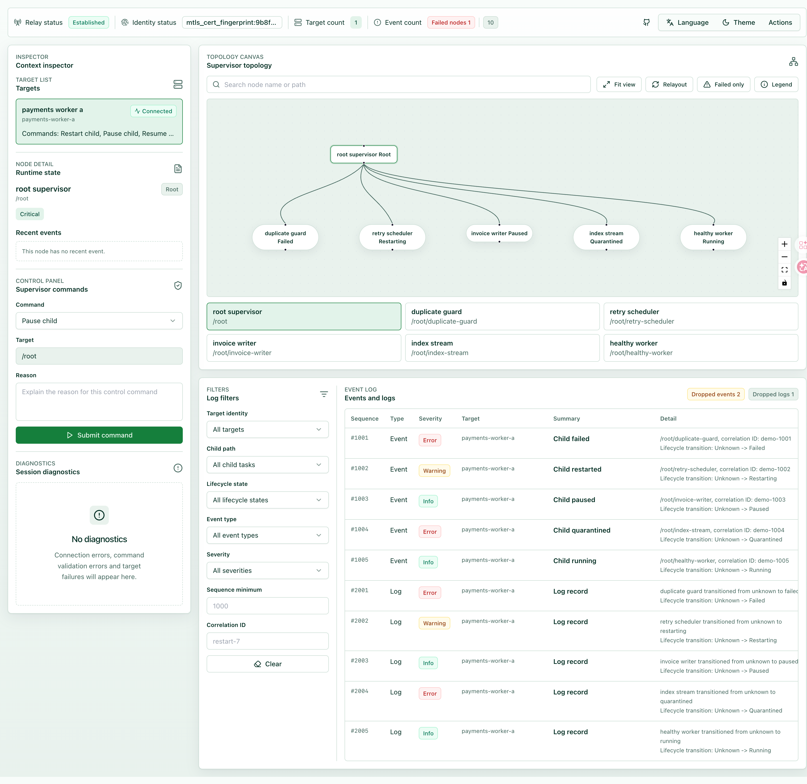

# rust-tokio-supervisor

`rust-tokio-supervisor` is the crates.io package for the rust-supervisor project. It is a Rust task supervision core for Tokio services. It provides declarative supervisor trees, child lifecycle governance, restart policies, four-stage shutdown, current state queries, event journal storage, and observability signals.

Terminology: rust-config-tree v0.1.9 is the centralized configuration loader, and Shutdown Without Orphaned Tasks is the formal shutdown term.

Package name: `rust-tokio-supervisor`. Library crate name: `rust_supervisor`.

## Project Links

- core library: [rust-supervisor](https://github.com/developerworks/rust-supervisor)
- relay: [rust-supervisor-relay](https://github.com/developerworks/rust-supervisor-relay)
- user interface: [rust-supervisor-ui](https://github.com/developerworks/rust-supervisor-ui)
- manual: [language selector](https://developerworks.github.io/rust-supervisor/), [English manual](https://developerworks.github.io/rust-supervisor/en/), [Chinese manual](https://developerworks.github.io/rust-supervisor/zh/)
- dashboard workflow: [English](https://developerworks.github.io/rust-supervisor/en/dashboard.html), [Chinese](https://developerworks.github.io/rust-supervisor/zh/dashboard.html)

## Design Principles

- Public API models come only from this project.
- No Compatibility: this crate has no legacy aliases or transition API surfaces.
- `current_state` answers only the current runtime state. It does not replace lifecycle event history.
- Configuration must be loaded through rust-config-tree v0.1.9, and runtime-tunable constants must not be scattered across internal modules.
- `SupervisorConfig` is the public root configuration struct. It supports `confique::Config`, `schemars::JsonSchema`, `serde::Serialize`, and `serde::Deserialize`.
- Dashboard IPC belongs only to the target process local entry point. This repository implements Unix domain socket IPC, snapshot generation, event records, log records, command mapping, and shared contracts.
- Shutdown must run request stop, graceful drain, abort stragglers, and reconcile.
- Shutdown terminology uses Shutdown Without Orphaned Tasks.

## Capability Boundary

- Declare `ChildSpec` and `SupervisorSpec`.
- Start fresh futures through `TaskFactory` or `service_fn`.
- Use `OneForOne`, `OneForAll`, and `RestForOne` supervision strategies.
- Produce `RestartDecision` values from typed failures, backoff, jitter, fuse rules, and the policy engine.
- Control a running tree through `SupervisorHandle` operations such as `add_child`, `remove_child`, `restart_child`, `pause_child`, `resume_child`, `quarantine_child`, `shutdown_tree`, `current_state`, and `subscribe_events`.
- Load the primary YAML configuration from `examples/config/supervisor.yaml`.
- Reuse `rust_supervisor::config::configurable::SupervisorConfig` for YAML loading, template generation, and JSON Schema generation.
- Emit structured logs, tracing spans, metrics, audit events, event journal entries, and `RunSummary` diagnostics.
- Enable target-side dashboard IPC through the optional `ipc` configuration section. The target process owns only local Unix domain socket IPC, snapshot generation, event conversion, command mapping, and shared JSON contracts.

## Dashboard

The supervisor dashboard feature uses three directories.

- [rust-supervisor](https://github.com/developerworks/rust-supervisor) at `~/rust-supervisor`: target process IPC and shared contracts.
- [rust-supervisor-relay](https://github.com/developerworks/rust-supervisor-relay) at `~/rust-supervisor-relay`: relay server, dynamic registration, `wss://`, mTLS, session gating, and command audit.
- [rust-supervisor-ui](https://github.com/developerworks/rust-supervisor-ui) at `~/rust-supervisor-ui`: Vue, shadcn-vue, Tailwind dashboard client.

The target process does not expose IPC to the network. It opens a local Unix domain socket only when `ipc.enabled=true`. A relay can read snapshots, but event and log subscriptions must be triggered by an established remote dashboard session.



## Configuration Schema

`SupervisorConfig` is the public root configuration struct. It supports `confique::Config`, `schemars::JsonSchema`, `serde::Serialize`, and `serde::Deserialize`, so users can reuse one model for YAML loading, template generation, and schema generation.

The official YAML files stay single-file by default:

- `examples/config/supervisor.yaml`: complete runnable configuration.
- `examples/config/supervisor.template.yaml`: complete single-file template.

This crate does not bake in `x-tree-split`. Projects that want split configuration files can wrap or reuse `SupervisorConfig` in their own crate and decide their own tree split layout.

The optional dashboard IPC section has this shape:

```yaml
ipc:
  enabled: true
  target_id: payments-worker-a
  path: /run/rust-supervisor/payments-worker-a.sock
  permissions: "0600"
  bind_mode: create_new
  registration:
    enabled: true
    relay_registration_path: /run/rust-supervisor/dashboard-relay-registration.sock
    display_name: "payments worker a"
    lease_seconds: 30
    registration_heartbeat_interval_seconds: 15
```

When `ipc.enabled=true`, `ipc.path` and `ipc.registration.relay_registration_path` must be absolute local paths. Registration uses dynamic registration. The relay configuration must not hard-code target lists.

## Quick Start

```bash
cargo run --example supervisor_quickstart
```

The example follows this path:

```rust
use rust_supervisor::runtime::supervisor::Supervisor;

#[tokio::main]
async fn main() -> Result<(), rust_supervisor::error::types::SupervisorError> {
    let handle = Supervisor::start_from_config_file("examples/config/supervisor.yaml").await?;
    let current = handle.current_state().await?;
    println!("{current:#?}");
    handle.shutdown_tree("operator", "quickstart complete").await?;
    Ok(())
}
```

## Examples

```bash
cargo run --example demo -- --config examples/config/supervisor.yaml
cargo run --example supervisor_quickstart
cargo run --example config_tree_supervisor
cargo run --example restart_policy_lab
cargo run --example shutdown_tree
cargo run --example observability_probe
cargo run --example supervisor_tree_story
cargo run --example runtime_control_story
cargo run --example policy_failure_matrix
cargo run --example diagnostic_replay
```

`cargo run --example demo -- --config examples/config/supervisor.yaml` is the three-end supervisor demo. It starts the library-only supervisor runtime from the same configuration file, then starts the demo-only dashboard IPC service and registration heartbeat inside `examples/demo`. This entry point is not the production binary for the crate, and it does not write demo state into the core `src` modules.

## Manuals

- [Published manual](https://developerworks.github.io/rust-supervisor/): language selector for the generated mdBook site.
- [English manual](https://developerworks.github.io/rust-supervisor/en/): generated English user manual.
- [Chinese manual](https://developerworks.github.io/rust-supervisor/zh/): generated Chinese user manual.
- [Dashboard workflow](https://developerworks.github.io/rust-supervisor/en/dashboard.html): generated three-end dashboard workflow in English.
- [Chinese dashboard workflow](https://developerworks.github.io/rust-supervisor/zh/dashboard.html): generated three-end dashboard workflow in Chinese.
- `manual/en/index.md`: English user manual.
- `manual/zh/index.md`: Chinese user manual.
- `docs/en/index.md`: English engineering documentation.
- `docs/zh/index.md`: Chinese engineering documentation.

## Quality Gates

```bash
cargo fmt --check
cargo check
cargo test
cargo doc --no-deps
cargo package --list
scripts/check-coding-standard.sh
scripts/check-maintainability.sh
scripts/generate-sbom.sh
scripts/validate-sbom.sh
cargo publish --dry-run
```

Dashboard validation spans all three directories:

```bash
cargo test
cargo test --manifest-path ~/rust-supervisor-relay/Cargo.toml
npm --prefix ~/rust-supervisor-ui install
npm --prefix ~/rust-supervisor-ui run test
npm --prefix ~/rust-supervisor-ui run build
npm --prefix ~/rust-supervisor-ui run test:e2e
```

Engineering gate details are documented in `docs/en/quality-gates.md` and `docs/zh/quality-gates.md`. Parallel implementation governance is documented in `docs/en/parallel-governance.md` and `docs/zh/parallel-governance.md`.

## License

This project is licensed under the MIT license. See `LICENSE`.
