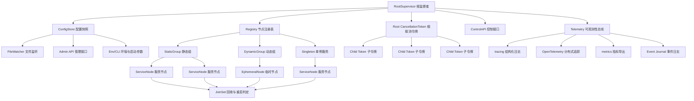

# 基于 Tokio 的 Rust Supervisor 架构设计研究报告

## 执行摘要

本报告建议采用一种 `Tokio-first(以 Tokio 为先)` 的 `Supervisor(监督者)` 架构, 而不是直接照搬完整 `actor framework(参与者框架)` 运行时. 具体做法是: 以 `CancellationToken(取消令牌)` 形成层级取消树, 以 `JoinSet(任务集合)` 负责失败回收与重启判定, 以 `TaskTracker(任务跟踪器)` 或等价等待机制负责优雅关闭, 以 `tracing(结构化诊断)` + `OpenTelemetry(开放遥测)` + `metrics(度量门面)` 作为一等能力内建到控制面. 重启语义应吸收 `Erlang/OTP(容错运行时设计原则)` 的 `one_for_one(单点重启)`, `one_for_all(全集重启)`, `rest_for_one(后续重启)`, `permanent/transient/temporary(永久/瞬态/临时)` 子任务类型, 以及 `restart intensity(重启强度)` 限流思想; 关闭语义应吸收 `tokio-graceful-shutdown` 的子系统树与部分子树关闭能力; 可用性与可读性则应吸收 `supervised` 的显式 `readiness(就绪)` 与分离式 `ServicePolicy(服务策略)`; 动态管理与运行时控制则可吸收 `task-supervisor` 和 `foxtive-supervisor` 的任务注册、健康检查、退避、分组与依赖管理能力。citeturn43view0turn45search1turn45search4turn45search2turn28search1turn28search7turn41search0turn29search1turn12view0turn24view2turn26view0turn9view0turn11view0turn15view0turn7view4turn7view3turn17view0

我的核心结论是: 对工业级 `Rust(系统编程语言)` 服务而言, 最稳妥的路线不是选择单一现成 `crate(软件包)` 作为最终形态, 而是组合成熟原语, 构建一个 `typed supervisor(类型化监督者)` 层. 这个层应把 `生命周期(生命周期)`、`失败域(故障边界)`、`重启预算(重启额度)`、`配置版本(配置版本号)` 与 `When/Where/What(何时/何地/何事)` 观测事件统一建模. 这样既能保持 `Tokio(异步运行时)` 生态兼容性与可读性, 又能避免被 `actor runtime(参与者运行时)` 绑定, 还能把日志、追踪与度量放到同一条控制链路上。citeturn8search11turn28search1turn29search1turn32search0turn32search9turn32search3turn33search16

## 现状评估与 crate 比较

`Erlang/OTP(容错运行时设计原则)` 把 `supervision tree(监督树)` 定义为容错软件的基础结构: `supervisor(监督者)` 负责启动、停止、监控子进程, 子进程按声明顺序启动, 按逆序关闭; 当重启次数在窗口内超过阈值时, 当前 `supervisor(监督者)` 自身也会关闭并向上升级故障。这个思想对 `Rust(系统编程语言)` 仍然成立, 但需要适配 `Tokio(异步运行时)` 的 `cooperative scheduling(协作式调度)` 现实, 以及 `async task(异步任务)` 与 `blocking task(阻塞任务)` 在取消语义上的差异。citeturn45search1turn45search4turn45search2turn42search9turn29search14

下表选择了 crates.io 上最有代表性的 `supervision crate(监督软件包)` 候选. 它们并不都等价, 有些偏 `restart(重启)`, 有些偏 `shutdown(关闭)`, 有些偏 `actor supervision(参与者监督)`, 但都能为 Tokio 上的工业级设计提供可吸收的优点。

| crate(软件包) | 核心模型 | 文档明确优势 | 主要短板或边界 | 适合作为 | 来源 |
|---|---|---|---|---|---|
| `supervised` | 小型 `tokio service supervisor(服务监督者)` | 单一 `SupervisedService(受监督服务)` trait(特征), `typed context(类型化上下文)`, 显式 `RestartPolicy(重启策略)`, `ServicePolicy(服务策略)`, `readiness(就绪)` 适配器, `Ctrl+C` 关闭监听, 默认关闭超时 5 秒 | 文档强调紧凑与显式语义, 动态任务管理与复杂树策略未突出 | 作为上层 API 形态与类型系统模板 | citeturn12view0turn24view2turn26view0turn27view0 |
| `task-supervisor` | `Tokio task(异步任务)` 保活器 | 自动重启, 指数退避, 运行时 `add/restart/kill/query(增删改查)` 控制, 健康检查间隔, 重启上限, `dead-task threshold(死亡任务阈值)` | 任务需实现 `Clone(克隆)`; 重启时从原始实例克隆, 运行期 `&mut self` 修改不会跨重启保留 | 作为动态控制面与简单任务保活层 | citeturn9view0turn11view0 |
| `tokio-graceful-shutdown` | `subsystem tree(子系统树)` 关闭编排 | 支持 `SIGINT/SIGTERM/Ctrl+C`, 子系统嵌套, 部分子树关闭, 关闭超时与错误传播, 子系统失败或 panic(恐慌) 触发整体关闭 | 文档重点是 `shutdown(关闭)` 编排; 自动 `restart(重启)` 策略未指定 | 作为关闭与错误汇总层 | citeturn15view0 |
| `tokio-task-supervisor` | `TaskTracker(任务跟踪器)` 封装 | 在 `tokio_util::task::TaskTracker` 外叠加共享 `CancellationToken(取消令牌)`, 提供协调关闭, `spawn_with_token(携带令牌启动)` 与 `shutdown(关闭)` | `restart(重启)`、监督树、失败策略未指定 | 作为最小关闭内核或嵌入式组件 | citeturn21view0 |
| `foxtive-supervisor` | 功能丰富的任务监督器 | 自动重启, `panic recovery(恐慌恢复)`, 依赖管理, 运行时增删停启, 任务组, `cron schedule(定时计划)`, `jitter(抖动)`, 限流, 持久化状态, 分层关闭, `tracing(结构化诊断)` 集成 | 功能面很宽, 学习和维护成本更高; `hot reload(热更新)` 当前表述为 `Hot Reload Ready(已为未来支持作准备)` | 作为高级策略与扩展点参考 | citeturn1search17turn7view4turn7view3turn7view5turn7view2 |
| `ractor-supervisor` | `OTP-style(OTP 风格)` `actor supervision(参与者监督)` | 提供静态、动态、任务三类 `supervisor(监督者)`, 支持 `OneForOne/OneForAll/RestForOne`, `Permanent/Transient/Temporary`, `meltdown(熔断式重启风暴保护)` | 绑定 `ractor(参与者框架)` 模型; 更适合参与者系统而非通用 Tokio 服务 | 作为监督树与重启预算语义来源 | citeturn17view0turn18search1turn18search5 |
| `bastion` | 自带运行时的监督系统 | 支持 `OneForOne/OneForAll/RestForOne`, `Always/Never/Tries`, 线性与指数退避, `backtrace(回溯)` 配置 | 不是 `Tokio-native(原生 Tokio)` 路线, 更像独立运行时; 最近文档版本为 `0.4.5` | 作为历史参照与策略来源, 不宜作为 Tokio-first 终态 | citeturn23view0turn23view1turn23view2turn23view3turn40search3 |

如果把范围再扩大, `supertrees` 也值得关注, 因为它明确声明自己受 `Erlang/OTP(容错运行时设计原则)` 启发, 面向 `Tokio(异步运行时)` 使用, 但其文档同时明确说明自己仍属 `experimental(实验性)` 且不建议直接用于生产, 并且 `monitoring/tracing/distributed messaging(监控/追踪/分布式消息)` 仍然缺失。这个结论反过来说明一个现实: `Rust(系统编程语言)` 生态里对于生产级 `supervision(监督)` 的通用答案仍未完全收敛。citeturn22search4

综合比较后, 最值得吸收的优点有五类. 第一, 从 `OTP(容错运行时设计原则)` 与 `ractor-supervisor` 吸收监督树、重启策略和重启强度窗口. 第二, 从 `supervised` 吸收 `typed context(类型化上下文)`、显式 `readiness(就绪)` 与分离式 `completed/error(完成/错误)` 处置. 第三, 从 `task-supervisor` 吸收运行时增删改查与任务级健康检查. 第四, 从 `tokio-graceful-shutdown` 与 `tokio-task-supervisor` 吸收分层关闭与协调等待. 第五, 从 `foxtive-supervisor` 吸收依赖、分组、退避、抖动、持久化和可观测性钩子。citeturn45search1turn45search4turn45search2turn17view0turn12view0turn24view2turn26view0turn9view0turn11view0turn15view0turn21view0turn7view4turn7view3

## 目标与非功能性需求

建议把目标拆成两层. 第一层是 `functional goal(功能目标)`: 长生命周期任务的注册、启动、依赖排序、显式就绪、关闭、失败分类、重启、升级故障、配置重载与观测事件归集. 第二层是 `non-functional requirement(非功能性需求)`: 稳定性优先, 可读性优先, 生态兼容优先, 然后才是极限吞吐。Tokio 官方文档强调任务是 `cooperative scheduling(协作式调度)`, 这意味着监督层不能把“立即抢占”当成事实, 而必须把取消、超时、关闭、回收与强制中断明确分层建模。citeturn42search9turn28search1turn41search0turn29search0turn29search14

| 维度 | 设计目标 | 建议落点 |
|---|---|---|
| 稳定性 | 单任务故障不扩散, 重启风暴有预算, 关闭有超时, panic(恐慌) 可分类 | 支持 `one_for_one`, `one_for_all`, `rest_for_one`, `escalate(升级)`; 每节点维护窗口计数与 `meltdown(重启风暴熔断)` |
| 性能 | 监督开销对常驻任务透明, 控制面操作近似 `O(log n)` 或更好 | 读路径无锁化, 状态快照用 `ArcSwap(原子 Arc 存储)`, 热路径避免频繁分配 |
| 资源使用 | 每任务内存和句柄成本可预测 | 任务元数据分层存储, 事件日志采用环形缓冲, 指标标签受控 |
| 故障恢复 | 支持自动重启、指数退避、抖动、预算耗尽升级 | 区分 `Completed/Error/Panic/Cancelled/Hung(完成/错误/恐慌/取消/假死)` |
| 可扩展性 | 支持静态树、动态子树、工作池 | 节点抽象统一, 动态孩子独立故障域 |
| 可测试性 | 可做时间冻结、并发模型检查、属性测试、基准测试 | 依赖 `tokio::time::pause/advance`, `loom(并发排列测试)`, `proptest(属性测试)`, `criterion(统计基准)` |
| 可部署性 | 与 `systemd(服务管理器)`, `Kubernetes(容器编排)`, `Prometheus(监控系统)`, `OTel Collector(遥测收集器)` 对接简单 | 退出码、健康探针、指标导出、追踪导出全部标准化 |
| 安全性 | 防止配置污染、标签爆炸、重启放大攻击 | 配置校验, 标签白名单, 指标端点访问控制, 预算上限 |
| 兼容性 | 与现有 Tokio 服务和常见网络栈平滑集成 | 不要求改写成参与者模型, 重点支持函数式任务与服务对象 |

与这些目标直接相关的事实基础是: `CancellationToken(取消令牌)` 支持父子令牌, 父令牌取消会传播到子令牌; `TaskTracker(任务跟踪器)` 适合在关闭阶段等待任务全部退出; `JoinSet(任务集合)` 适合按完成顺序回收任务并得到失败结果; `spawn_blocking(阻塞任务启动)` 一旦开始执行通常不可通过 `abort(中止)` 强制打断, 因而必须作为独立故障域对待。运行时还提供 `RuntimeMetrics(运行时度量)` 以暴露 `num_alive_tasks(存活任务数)` 与 `global_queue_depth(全局队列深度)` 等指标。citeturn41search0turn28search7turn29search1turn29search14turn31search13turn30search0

## 推荐架构

推荐架构的核心原则是 `control plane(控制面)` 与 `data plane(数据面)` 分离. `control plane(控制面)` 负责注册、拓扑、配置版本、关闭、重启预算和观测; `data plane(数据面)` 只负责真正业务任务的执行. 这样能显著降低业务代码复杂度, 同时使 `When/Where/What(何时/何地/何事)` 观测成为系统级契约, 而不是“出错时再补日志”的事后行为。这个方向与 `tracing(结构化诊断)` 的设计一致, 因为 `tracing(结构化诊断)` 本身就是为了给异步系统提供带时序与因果上下文的结构化事件流。citeturn32search0turn32search8turn32search11



建议的节点模型分为四层. 根节点 `RootSupervisor(根监督者)` 只做全局协调. 组节点 `SupervisorGroup(监督组)` 管理一个失败域, 支持 `one_for_one`, `one_for_all`, `rest_for_one`. 叶子节点 `ServiceNode(服务节点)` 绑定一个任务工厂与策略. 最下层执行实体是 `TaskInstance(任务实例)`。父子取消关系应基于 `CancellationToken::child_token(子令牌)` 建模, 故障回收应基于 `JoinSet(任务集合)` 建模, 关闭等待则使用统一的 `drain(排空)` 过程。这与 Tokio 官方推荐的“先发取消信号, 再等待退出”的优雅关闭模式是一致的。citeturn41search0turn28search1turn28search7turn29search1

关闭与重启应分为 4 个阶段. 第一阶段是 `request stop(请求停止)`: 向子树发出取消信号. 第二阶段是 `graceful drain(优雅排空)`: 等待任务在截止时间内完成清理. 第三阶段是 `abort stragglers(中止拖尾任务)`: 仅对可中止的异步任务使用 `AbortHandle(中止句柄)` 或 `JoinHandle::abort(任务中止)`; 对 `spawn_blocking(阻塞任务启动)` 的工作, 必须通过更外层隔离, 例如专用线程池、外部进程或幂等作业协议来兜底. 第四阶段是 `reconcile(状态对账)`: 更新注册表、指标、事件日志与 `RunSummary(运行摘要)`。citeturn29search0turn29search14turn28search7

配置与热更新建议采用 `versioned snapshot(版本化快照)` 路线. 配置读取用 `Serde(序列化框架)` 的 `Deserialize(反序列化)` 建模, 文件监听用 `notify(文件系统通知)` 的 `recommended_watcher(推荐监听器)`; 若平台事件不稳定, 则回退到 `poll watcher(轮询监听器)`. 新配置通过 `ArcSwap(原子 Arc 存储)` 发布, 读路径保持无锁. 日志级别的热更新可直接利用 `tracing-subscriber(追踪订阅器)` 的 `with_filter_reloading(过滤器热重载)`。对于树结构的变更, 建议执行 `diff(差异比较)` 后进行“原地调整”或“子树滚动替换”, 而不要追求 `Erlang(函数式并发语言)` 那类 `VM-level hot code swap(虚拟机级热代码替换)`。后者在 OTP 里有专门的更新机制, 而在 Rust/Tokio 世界更稳妥的等价物通常是“版本化配置 + 子树滚动重建”。citeturn34search2turn34search14turn34search3turn34search6turn34search12turn34search7turn34search10turn32search17turn45search8

## 关键数据结构与 API 草案

先给出关键设计选项. 这部分不是对现有某个 `crate(软件包)` 的复述, 而是基于前述材料收敛出的推荐形态。

| 设计点 | 方案 A | 方案 B | 建议选择 | 原因 |
|---|---|---|---|---|
| 服务抽象 | `Future factory(任务工厂函数)` | `Service trait(服务特征)` | `Service trait(服务特征)` + `service_fn(函数适配器)` | 兼顾可读性与可组合性, 吸收 `supervised` 的紧凑接口 |
| 拓扑管理 | 全局平铺任务表 | 树形节点注册表 | 树形节点注册表 | 便于实现故障域、依赖顺序与子树关闭 |
| 取消传播 | 广播式共享令牌 | 父子令牌树 | 父子令牌树 | `CancellationToken(取消令牌)` 已原生支持子令牌, 更贴近监督树 |
| 失败分类 | 只区分成功/失败 | 完成/错误/恐慌/取消/假死 | 细分类 | 便于 `transient(瞬态)` 与 `temporary(临时)` 语义 |
| 重启预算 | 全局统一预算 | 节点预算 + 组预算 | 双层预算 | 既防单点抖动, 也防子树级重启风暴 |
| Readiness(就绪) | 启动即就绪 | 显式标记就绪 | 显式标记, 默认立即就绪 | 吸收 `supervised` 经验, 适合缓存预热、连接建立 |
| Health(健康检查) | 只拉模式 | 推拉结合 | 推拉结合 | 推模式降低耦合, 拉模式利于探针与诊断 |
| 热更新 | 直接可变共享状态 | 版本化快照 | 版本化快照 | 更可测, 与 `ArcSwap(原子 Arc 存储)` 契合 |
| 关闭语义 | 只取消 | 取消 + 排空 + 强制中止 | 三段式 | 符合 Tokio 官方优雅关闭建议 |
| 观测模型 | 日志附加字段 | 统一事件模型 | 统一事件模型 | 便于 `When/Where/What(何时/何地/何事)` 语义一致 |

下面给出建议的数据结构与 `API(应用编程接口)` 草案.

| 类型 | 关键字段 | 作用 |
|---|---|---|
| `SupervisorBuilder<S>` | `root_state`, `default_policy`, `shutdown_timeout`, `telemetry`, `config_source` | 构建根监督者 |
| `NodeId` | `path`, `stable_name`, `generation` | 提供稳定路径与代际信息 |
| `GroupSpec` | `strategy`, `budget`, `children`, `dependencies` | 定义子树失败域 |
| `ServiceSpec<S>` | `id`, `kind`, `policy`, `readiness`, `health`, `factory` | 定义单个服务节点 |
| `ServiceContext<S>` | `state`, `node`, `token`, `readiness`, `event_sink`, `config` | 任务运行时上下文 |
| `RestartPolicy` | `Never`, `Permanent`, `Transient`, `Temporary`, `Attempts` | 何时重启 |
| `RestartBackoff` | `base`, `factor`, `max_delay`, `jitter`, `reset_after` | 如何退避 |
| `FailureBudget` | `max_restarts`, `window`, `escalate_to_parent` | 重启风暴保护 |
| `ServiceExit` | `Completed`, `Error`, `Panicked`, `Cancelled`, `TimedOut` | 任务出口分类 |
| `RunSummary` | `started_at`, `ended_at`, `shutdown_cause`, `restarts`, `failures` | 运行摘要与诊断输出 |
| `ConfigSnapshot<C>` | `version`, `loaded_at`, `checksum`, `data` | 热更新配置快照 |
| `SupervisorEvent` | `when`, `where_`, `what`, `severity`, `trace` | 统一观测事件 |

建议的 `trait(特征)` 大致如下. 这个草案刻意保持小而完整, 以避免像某些全功能运行时那样把所有策略都耦合到一个巨型接口里。

```rust
use std::time::Duration;
use async_trait::async_trait;

#[derive(Debug, Clone)]
pub enum ServiceExit {
    Completed,
    Error(String),
    Panicked(String),
    Cancelled,
    TimedOut,
}

#[derive(Debug, Clone)]
pub enum RestartPolicy {
    Never,
    Permanent,
    Transient,
    Temporary,
    Attempts { max_restarts: usize, window: Duration },
}

#[async_trait]
pub trait Service<S>: Send + Sync + 'static {
    fn id(&self) -> &'static str;

    async fn prepare(&self, _ctx: &mut ServiceContext<S>) -> anyhow::Result<()> {
        Ok(())
    }

    async fn run(&self, ctx: ServiceContext<S>) -> anyhow::Result<()>;

    async fn shutdown(&self, _ctx: &mut ServiceContext<S>) -> anyhow::Result<()> {
        Ok(())
    }

    fn restart_policy(&self) -> RestartPolicy {
        RestartPolicy::Transient
    }

    fn shutdown_timeout(&self) -> Duration {
        Duration::from_secs(30)
    }
}
```

典型使用方式建议长这样. 这段代码不是现有 `crate(软件包)` 的直接 `API(应用编程接口)`, 而是建议终态.

```rust
let supervisor = SupervisorBuilder::new(app_state)
    .shutdown_timeout(Duration::from_secs(30))
    .group("ingest", |g| {
        g.strategy(RestartStrategy::OneForOne)
            .budget(FailureBudget::new(8, Duration::from_secs(60)))
            .service(DbReplicator::new())
            .service(EventConsumer::new().depends_on("db-replicator"));
    })
    .group("api", |g| {
        g.strategy(RestartStrategy::RestForOne)
            .service(HttpServer::new())
            .service(GrpcServer::new().depends_on("http-server"));
    })
    .with_config_file("supervisor.toml")
    .with_metrics()
    .with_tracing()
    .build();

let summary = supervisor.run().await?;
```

如果需要给出更贴近“今天就能写”的 `Rust + Tokio(系统编程语言 + 异步运行时)` 例子, 我建议最小原型采用下面这种监督循环. 它直接使用 `CancellationToken(取消令牌)`、`tokio::spawn(任务启动)`、`JoinHandle(任务句柄)` 和退避策略, 非常适合做第一阶段落地样板。

```rust
use std::time::Duration;
use tokio::time::sleep;
use tokio_util::sync::CancellationToken;
use tracing::{error, info, warn};

async fn worker(child: CancellationToken) -> anyhow::Result<()> {
    loop {
        tokio::select! {
            _ = child.cancelled() => {
                info!(service = "worker", "shutdown requested");
                break;
            }
            _ = sleep(Duration::from_secs(1)) => {
                // 模拟业务工作
                info!(service = "worker", "tick");
            }
        }
    }
    Ok(())
}

async fn supervise(root: CancellationToken) -> anyhow::Result<()> {
    let mut attempt = 0usize;

    loop {
        let child = root.child_token();
        let handle = tokio::spawn(worker(child.clone()));

        tokio::select! {
            _ = root.cancelled() => {
                child.cancel();
                match tokio::time::timeout(Duration::from_secs(10), handle).await {
                    Ok(joined) => {
                        match joined {
                            Ok(Ok(())) => info!("worker stopped cleanly"),
                            Ok(Err(err)) => warn!(error = %err, "worker stopped with error during shutdown"),
                            Err(join_err) if join_err.is_panic() => error!("worker panicked during shutdown"),
                            Err(join_err) if join_err.is_cancelled() => warn!("worker cancelled during shutdown"),
                            Err(_) => error!("worker join failed"),
                        }
                    }
                    Err(_) => {
                        warn!("worker shutdown timeout");
                    }
                }
                return Ok(());
            }
            joined = handle => {
                match joined {
                    Ok(Ok(())) => {
                        warn!("worker exited unexpectedly without error");
                    }
                    Ok(Err(err)) => {
                        warn!(attempt, error = %err, "worker returned error");
                    }
                    Err(join_err) if join_err.is_panic() => {
                        error!(attempt, "worker panicked");
                    }
                    Err(join_err) if join_err.is_cancelled() => {
                        warn!(attempt, "worker cancelled");
                    }
                    Err(_) => {
                        error!(attempt, "worker join failed");
                    }
                }

                attempt += 1;
                let backoff = Duration::from_millis((1000_u64).saturating_mul(1 << attempt.min(5)));
                sleep(backoff).await;
            }
        }
    }
}
```

上面这段最小实现之所以合理, 是因为 `CancellationToken(取消令牌)` 本身支持父子关系, `JoinError(任务等待错误)` 能区分 `cancelled(已取消)` 与 `panic(恐慌)`, 而 `JoinSet(任务集合)` 还可以进一步把这种模式推广到多个子任务并按完成顺序回收。citeturn41search0turn29search8turn29search1

## 可观测性与调试

建议把可观测性设计成统一事件模型, 而不是三套各自为政的数据结构. `tracing(结构化诊断)` 官方文档强调 `span(跨度)` 具有开始与结束时间, 能形成嵌套树并记录类型化字段; `tracing-opentelemetry(追踪到开放遥测桥接层)` 又能把 `tracing(结构化诊断)` 的 `span/event(跨度/事件)` 映射到 `OpenTelemetry(开放遥测)` 的 `span/event(跨度/事件)` 模型; `OpenTelemetry(开放遥测)` 本身则把 `traces/metrics/logs(追踪/度量/日志)` 视为统一的 `signals(遥测信号)`。因此, 最合理的做法不是“日志归日志, 指标归指标”, 而是先定义统一事件, 再派生到三种信号。citeturn32search0turn32search9turn32search2turn32search3turn32search10turn32search19

### When/Where/What 事件模型

| 维度 | 字段 | 说明 |
|---|---|---|
| `When(何时)` | `ts_wall`, `ts_mono`, `uptime_ms`, `attempt`, `config_version` | 绝对时间, 单调时间, 运行时长, 第几次重启, 当前配置版本 |
| `Where(何地)` | `node_path`, `service_id`, `group_id`, `task_id`, `file`, `line`, `host`, `pod` | 节点路径, 服务身份, 任务身份, 代码位置, 部署位置 |
| `What(何事)` | `phase`, `action`, `outcome`, `error_class`, `panic`, `shutdown_cause`, `restart_policy` | 生命周期阶段, 本次动作, 结果, 错误分类, 关闭原因, 重启策略 |

建议日志示例采用 `JSON(结构化数据格式)` 行格式. 下面是一个推荐样例:

```json
{
  "ts_wall": "2026-05-03T18:25:41.238Z",
  "ts_mono_ns": 615432198877,
  "level": "WARN",
  "trace_id": "4f9c4a0e535bb8f4d03f5c4f4db0a8d1",
  "span_id": "7a0b88d6bc32e9fa",
  "node_path": "root/ingest/event-consumer",
  "service_id": "event-consumer",
  "task_id": "tokio-18446744073709551615",
  "phase": "run",
  "action": "exit",
  "outcome": "error",
  "error_class": "io.transient",
  "message": "consumer loop failed, scheduling restart",
  "attempt": 3,
  "restart_policy": "transient",
  "restart_delay_ms": 4000,
  "config_version": 17
}
```

建议追踪使用以生命周期为中心的 `span(跨度)` 命名. 例如: `supervisor.start`, `service.prepare`, `service.ready`, `service.run`, `service.shutdown`, `supervisor.restart`, `supervisor.escalate`. 若使用 `tracing-opentelemetry(追踪到开放遥测桥接层)`, 子 `span(跨度)` 与父子关系会自动映射到 `OpenTelemetry(开放遥测)` 模型。citeturn32search9turn32search2

建议指标命名保持稳定且低基数. `metrics(度量门面)` 提供统一宏, `Prometheus exporter(普罗米修斯导出器)` 则支持抓取端点、推送网关、全局标签、桶配置与 `allowlist(允许列表)`。因此, 适合定义如下核心指标:

| 指标名 | 类型 | 标签 | 含义 |
|---|---|---|---|
| `supervisor_restarts_total` | `counter(计数器)` | `node`, `service`, `reason` | 重启总次数 |
| `supervisor_escalations_total` | `counter(计数器)` | `group`, `strategy` | 向父级升级的次数 |
| `supervisor_running_tasks` | `gauge(仪表)` | `group` | 当前运行任务数 |
| `supervisor_shutdown_duration_seconds` | `histogram(直方图)` | `group`, `outcome` | 关闭耗时 |
| `supervisor_restart_delay_seconds` | `histogram(直方图)` | `service` | 重启退避时长 |
| `supervisor_task_uptime_seconds` | `histogram(直方图)` | `service` | 单实例存活时长 |
| `supervisor_events_dropped_total` | `counter(计数器)` | `sink` | 事件丢弃数 |
| `supervisor_config_version` | `gauge(仪表)` | `scope` | 当前配置版本 |

这些类型和导出能力都能直接落在 `metrics(度量门面)` 与 `metrics-exporter-prometheus(普罗米修斯导出器)` 上。citeturn33search16turn33search3turn33search6turn33search0turn33search12turn33search1

### 调试与回溯策略

对异步系统, 只抓 `Backtrace(栈回溯)` 往往不够. `std::backtrace(标准回溯)` 可以捕获线程栈, 但其文档也明确提示, 开启回溯会带来性能和内存成本, 并通常受 `RUST_BACKTRACE/RUST_LIB_BACKTRACE(环境变量)` 控制. 与此同时, `tracing-error(错误追踪扩展)` 的 `SpanTrace(跨度回溯)` 会记录逻辑上的 `span(跨度)` 链路, 对异步任务尤其有效, 因为它关注的是“业务上下文走到了哪里”, 而不是“执行器的轮询栈长什么样”。citeturn36search0turn36search2turn46search1turn46search3turn46search4

因此, 建议调试分三层. 第一层是默认层: `panic::set_hook(恐慌钩子)` 补充 `location(代码位置)` 与配置版本, 所有错误默认用 `SpanTrace(跨度回溯)` 记录, 非致命错误默认不强制抓 `Backtrace(栈回溯)`。第二层是按需层: 在预发或限流生产环境启用 `console-subscriber(Tokio 控制台订阅器)`, 它可以在后台线程启动自己的服务, 并暴露任务与资源的运行视图. 第三层是事后层: 根监督者维护固定大小的 `event journal(事件日志缓冲区)`, 当发生升级故障时, 把最近 N 条事件打包到 `RunSummary(运行摘要)` 或落盘。citeturn36search1turn36search5turn46search0turn35search5

## 测试, 基准与验收

测试策略必须覆盖时间、并发、状态机、关闭、重启和观测. Tokio 官方文档给出了一个非常关键的工具箱: `tokio::time::pause(时间冻结)`、`advance(时间推进)`、`start_paused(启动即冻结时间)`。这使得退避、预算窗口、关闭超时和探针周期都可以做确定性测试, 不必在 `sleep(休眠)` 上消耗真实时钟。citeturn42search0turn42search1turn42search3

建议测试分成五层:

第一层是 `unit test(单元测试)`. 覆盖 `RestartPolicy(重启策略)`、`FailureBudget(失败预算)`、依赖拓扑排序、配置差异比对、事件编码和标签白名单。时间相关逻辑一律跑在冻结时间上。citeturn42search0turn42search1

第二层是 `integration test(集成测试)`. 覆盖以下场景: 子任务正常退出是否按 `ServicePolicy(服务策略)` 处理; 子任务返回错误后是否按 `permanent/transient/temporary(永久/瞬态/临时)` 生效; `one_for_all(全集重启)` 与 `rest_for_one(后续重启)` 是否按顺序关闭和重启; `shutdown timeout(关闭超时)` 到期后是否只中止可中止任务; 配置热更新是否按差异触发原地调整或子树滚动替换。策略来源直接对应 OTP 监督原则。citeturn45search1turn45search4turn45search5

第三层是 `model checking(并发模型检查)`. `loom(并发排列测试)` 的官方说明很适合验证注册表、状态转换、就绪标记、预算窗口计数等内部并发结构, 因为它会对可能的并发执行顺序做系统化排列。凡是涉及锁、原子变量、环形缓冲区和取消竞态的代码, 都应至少有一组 `loom(并发排列测试)` 用例。citeturn37search0turn37search1

第四层是 `property-based test(属性测试)`. 对任务列表、依赖图、重启原因序列和配置变更序列做随机生成, 断言关键不变量, 例如“关闭后不会再接收新任务”, “预算耗尽后不再继续局部重启”, “同一个配置版本不会重复应用结构性变更”。`proptest(属性测试框架)` 很适合做这一层。citeturn37search7turn37search11

第五层是 `benchmark(基准测试)` 与 `soak test(长期稳定性测试)`. `criterion(统计基准)` 提供预热、测量、分析和回归比较四阶段模型, 还支持 `Tokio(异步运行时)` 的异步基准. 监督层至少应有以下基准组: 启动 1/10/100/1000 个长驻任务; 每秒添加与移除动态任务; 高频失败重启; 配置热更新; 日志与追踪打开/关闭对吞吐和延迟的影响。citeturn38search0turn38search3turn38search9

建议的性能与稳定性评估场景如下:

| 场景 | 目标 | 关键指标 |
|---|---|---|
| 稳态长驻任务 | 验证常驻任务监督开销 | `cpu_percent`, `memory_per_task`, `running_tasks`, `event_rate` |
| 高频失败重启 | 验证退避、预算与升级故障 | `restart_latency_p50/p99`, `restart_budget_exhaustions`, `escalations_total` |
| 关闭风暴 | 验证树形关闭与拖尾中止 | `shutdown_duration`, `shutdown_timeout_count`, `orphan_tasks` |
| 动态扩缩容 | 验证注册表与控制面性能 | `add/remove_latency`, `registry_lock_contention`, `global_queue_depth` |
| 观测压力 | 验证日志、追踪、指标开销 | `telemetry_overhead`, `events_dropped_total`, `trace_export_backpressure` |
| 配置抖动 | 验证热更新收敛性 | `reload_apply_latency`, `reload_failures_total`, `config_version_lag` |
| 阻塞任务隔离 | 验证 `spawn_blocking(阻塞任务启动)` 故障域 | `blocking_queue_depth`, `shutdown_tail_latency`, `forced_process_restarts` |

这里的运行时观测可以直接结合 Tokio 的 `RuntimeMetrics(运行时度量)`。特别是 `num_alive_tasks(存活任务数)` 与 `global_queue_depth(全局队列深度)` 很适合纳入基准期间的背景指标。citeturn30search0turn31search13

建议的首版验收标准如下. 这些数值不是行业统一标准, 而是适合作为团队内部 `service level objective(服务级目标)` 的起点: 在 500 个长驻任务规模下, 监督层 CPU 占比不高于业务总 CPU 的 5%; 单任务元数据平均内存开销不高于 2 KiB; 单节点错误导致的 `one_for_one(单点重启)` 从检测到重启完成的 `p99(九十九分位)` 小于 2 秒; 常规关闭在 30 秒预算内完成的比例不低于 99.9%; 配置热更新失败不会破坏旧版本快照, 且失败时必须可回滚到前一版本。以上阈值建议用 `criterion(统计基准)`、`soak test(长期稳定性测试)` 与运行时指标共同验证。citeturn38search0turn38search3turn30search0

## 迁移与演进建议

迁移路线不应要求团队一次性重写所有后台任务. 最稳妥的方法是四阶段演进.

第一阶段, `observe-first(先观测)`. 不改业务模型, 先给现有 `Tokio(异步运行时)` 任务统一加 `tracing(结构化诊断)`、`metrics(度量门面)`、`CancellationToken(取消令牌)` 和显式关闭契约. 这样能立刻建立 `When/Where/What(何时/何地/何事)` 事件模型, 同时暴露“哪些任务根本无法优雅停止”的现实问题。citeturn32search0turn33search16turn28search1

第二阶段, `wrap-existing-tasks(封装既有任务)`. 为现有任务提供 `service_fn(函数适配器)` 风格的包装器, 让它们进入统一的 `ServiceContext(服务上下文)` 与 `RestartPolicy(重启策略)` 模型. 这一步可直接吸收 `supervised` 的小接口形态, 因为它已经证明 `typed context(类型化上下文)`、默认策略和显式就绪模式可以在少量 API 上成立。citeturn12view0turn24view2turn26view0

第三阶段, `introduce-failure-domains(引入故障域)`. 按系统边界拆出 `group(监督组)`: 例如 `api(接口层)`, `ingest(接入层)`, `scheduler(调度层)`, `worker-pool(工作池)`。对最外层 `api(接口层)` 多采用 `one_for_one(单点重启)`, 对强依赖顺序链路采用 `rest_for_one(后续重启)`, 对必须整体一致的聚合子系统采用 `one_for_all(全集重启)`。这些都直接来自 OTP 监督原则。citeturn45search4turn45search1

第四阶段, `control-plane-hardening(控制面加固)`. 引入配置热更新、动态任务注册、子树级操作、运维 `Admin API(管理接口)`、事件日志缓冲、观测导出治理与回滚机制. 当走到这一步时, 系统已经不是“若干 Tokio 任务的集合”, 而是“一个可解释、可回滚、可升级的监督系统”了。热更新层推荐用 `Serde(序列化框架)` + `notify(文件系统通知)` + `ArcSwap(原子 Arc 存储)`, 日志过滤热更新则交给 `tracing-subscriber(追踪订阅器)`。citeturn34search2turn34search3turn34search6turn34search7turn34search10turn32search17

与现有生态的集成建议如下. 对 `axum(异步 Web 框架)`、`tonic(异步 gRPC 框架)` 这一类典型 Tokio 服务, 监督层不应“包住整个运行时”, 而应“包住启动与关闭契约”, 即把监听器、后台同步器、缓存预热器、定时作业与消息消费者都纳入同一棵树, 同时保留应用对 `tower middleware(中间件)` 与 `tracing(结构化诊断)` 的原有使用方式. 对数据库驱动或消息队列客户端, 监督层只负责外部生命周期, 不侵入连接池实现. 对 `spawn_blocking(阻塞任务启动)` 负载, 建议单独建组, 默认使用 `Temporary(临时型)` 或“失败即升级”的策略, 避免把不可中止的阻塞任务与普通异步任务放在同一关闭预算里。citeturn29search14turn42search9

### 维护与演进建议清单

- 保持 `Supervisor(监督者)` 内核小而稳定, 高级策略全部做成可替换模块.
- 所有策略对象都实现 `Debug(调试输出)` 与可序列化快照, 便于回放与问题定位.
- 事件字段与指标标签必须有版本管理, 禁止在未审查情况下增长标签维度.
- `panic(恐慌)`、`error(错误)`、`cancel(取消)`、`timeout(超时)` 必须是四个不同的一等概念.
- `spawn_blocking(阻塞任务启动)` 要单独建模, 不可与普通任务共用“必可中止”假设.
- 所有热更新都走“先校验, 后发布, 再生效, 可回滚”的四步流程.
- 每个 `group(监督组)` 都要有明确的失败升级策略, 不能隐式冒泡.
- 控制面依赖的锁、原子与缓冲区必须持续用 `loom(并发排列测试)` 守护.
- 基准测试要纳入持续集成, 以捕捉版本升级后的性能回退.
- 观测默认开启, 调试增强按需开启; 对 `console-subscriber(Tokio 控制台订阅器)` 之类工具要有环境隔离和访问控制。citeturn37search0turn38search0turn46search0

### 开放问题与限制

- `hot reload(热更新)` 在本报告中定义为“配置与子树滚动替换”. 对 `VM-level hot code swap(虚拟机级热代码替换)` 不做承诺. 若业务确实需要类似 OTP 的代码热升级能力, 需要额外研究插件边界、进程隔离或 `WASM(沙箱模块)` 路线。OTP 里对监督者代码替换有现成机制, Rust/Tokio 侧公开方案未形成统一标准。citeturn45search8
- 某些候选 `crate(软件包)` 的部分行为在公开文档中未完全指定, 例如 `tokio-graceful-shutdown` 的自动重启策略与 `tokio-task-supervisor` 的监督树策略. 本报告已在比较中明确标注“未指定”, 未做推断。citeturn15view0turn21view0
- `spawn_blocking(阻塞任务启动)` 的终止语义天然弱于普通异步任务, 这决定了任何工业级监督方案都必须接受“有些工作只能隔离, 不能立即中止”的现实边界。citeturn29search14

最终建议可以概括为一句话: 以 `Tokio(异步运行时)` 原语为底, 以 `OTP(容错运行时设计原则)` 语义为形, 以 `supervised/task-supervisor/tokio-graceful-shutdown/foxtive-supervisor(代表性监督软件包)` 的优点为料, 构建一个 `typed, observable, restart-aware(类型化/可观测/具备重启语义)` 的 `Supervisor(监督者)` 层. 这条路线比直接押注某个功能最全的单一 `crate(软件包)` 更稳, 也更符合 `Rust(系统编程语言)` 生态对可维护性、显式语义和组合式设计的一贯风格。citeturn43view0turn45search1turn45search4turn12view0turn9view0turn15view0turn7view4turn32search0turn33search16